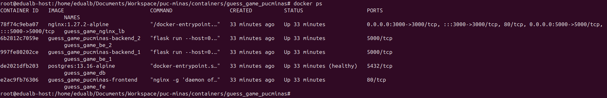
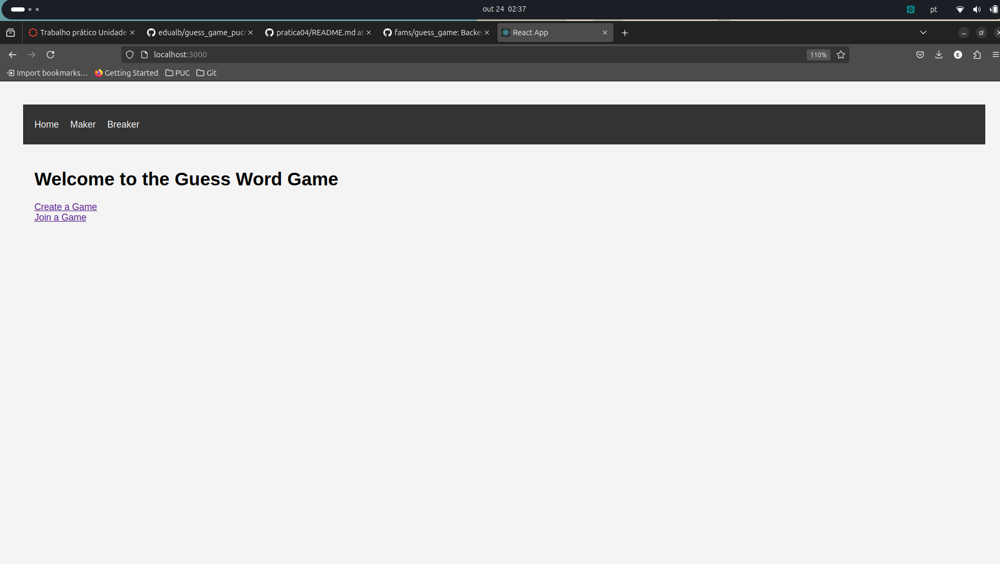
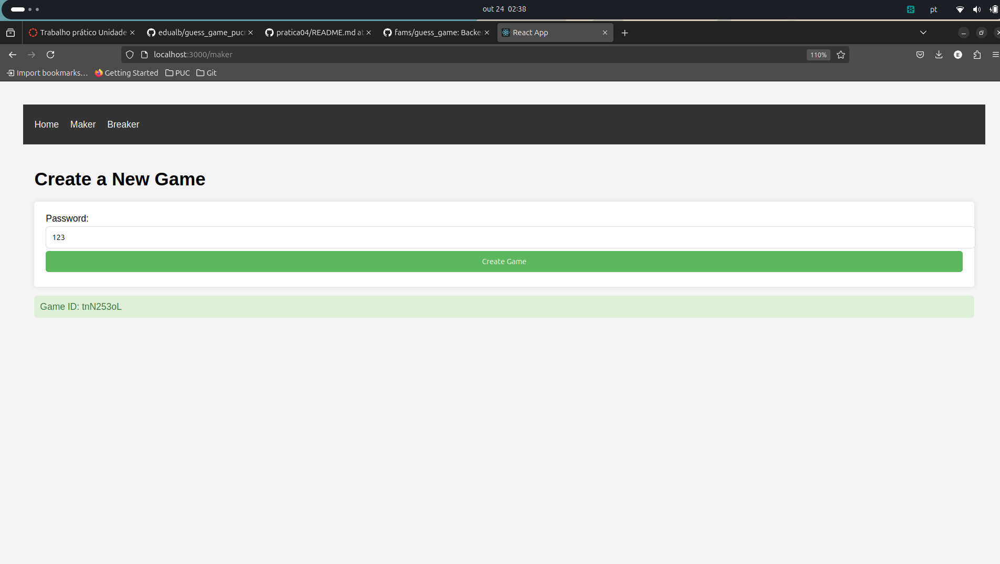
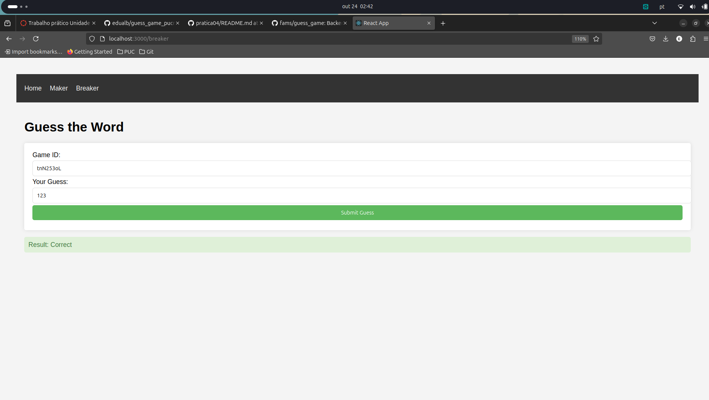
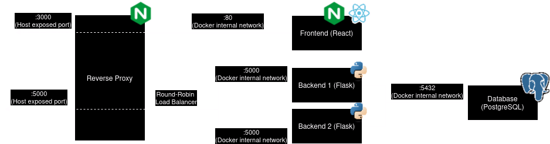

# guess_game_pucminas
Trabalho prático Unidade 1 Docker (PUC Minas - Dev)

Autor: Eduardo Albuquerque da Silva

# Execução do Projeto
Com o Docker instalado em sua máquina, é possível executar o projeto com o seguinte comando em um terminal:

```sh
$ docker compose up -d --build
```

## Evidências






# Atualização de versão
Para atualizar as versões é preciso somente alterar a versão da imagem docker:

- Backend (`Dockerfile.backend`)
    ```dockerfile
    FROM python:{version}
    ```
- Frontend (`Dockerfile.frontend`)
    ```dockerfile
    FROM node:{version} AS build
    # ...
    FROM nginx:{version}
    ```
- Proxy Reverso (`docker-compose.yaml`)
    ```yaml
    services:
        nginx:
            image: nginx:{version}
            container_name: guess_game_nginx_lb
    # ...
    ```
- Database (`docker-compose.yaml`)
    ```yaml
    services:
    # ...
        database:
            image: postgres:{version}
            container_name: guess_game_db
    # ...
    ```

# Design
Abaixo tem a representação da Arquitetura do sistema. Cada retângulo representa um container.



As escolhas de volumes, redes e de balanceamento de carga foi baseada no mais simples possivel. De acordo com as necessidades a gente pode eventualmente incluir mais complexidade nas escolhas.

## Rede
No `docker-compose.yaml` foi definido explicitamente uma network (muito por gosto pessoal). Poderia muito bem não declarar visto que estamos utilizando o Network Driver default (bridge).

```yaml
networks:
  guess_game_net: {}
```

É possível inspecionar a rede com os seguintes comandos:

```sh
$ docker network ls
$ docker network inspect { network_id ou network_name }
```

## Volumes
Na maioria dos volumes feitos, não estamos persistindo nada. No entando no caso do volume do Database foi criado um volume persistente no `docker-compose.yaml` utilizando o Storage Driver default (local):

```yaml
volumes:
  database:
```

É possível inspecionar os volumes com os seguintes comandos:

```sh
$ docker volume ls
$ docker volume inspect { volume_name }
```

Caso realize a inspeção do volume, será possível identificar onde os arquivos estão localizados no Host. O campo que identifica isso é o `Mountpoint`:

```json
[
    {
        "CreatedAt": "2024-10-24T02:00:16+01:00",
        "Driver": "local",
        "Labels": {
            "com.docker.compose.project": "guess_game_pucminas",
            "com.docker.compose.version": "2.25.0",
            "com.docker.compose.volume": "database"
        },
        "Mountpoint": "/var/lib/docker/volumes/guess_game_pucminas_database/_data",
        "Name": "guess_game_pucminas_database",
        "Options": null,
        "Scope": "local"
    }
] 
```

## Proxy Reverso
Estamos utilizando como proxy reverso o Nginx. A configuração do nginx pode ser encontrado dentro das pastas `configs/backend/default.conf` e `configs/frontend/default.conf`.

Na configuração do backend estamos fazendo um balanceamento de carga entre dois containers. O algoritmo utilizado é o default do Nginx (round-robin).

Na configuração do frontend está sendo realizado um redirecionamento para um outro container sem nenhum balanceamento de carga.